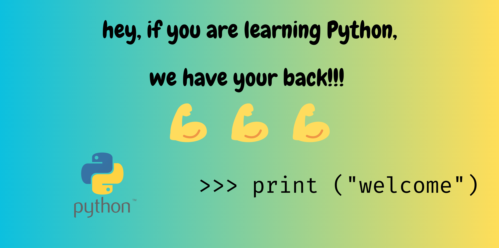

# Introduction to Computer Programming
Welcome to the first chapter of this book! In this chapter, we will cover the basics of computer programming with [Python](https://www.python.org/).

🐍 Python is a very powerful programming language that is widely used in the fields of engineering and management. 
Python is also very popular for beginners because it is quite intuitive and easy to learn and use. 

The main objectives of this chapter are: 

📝 Learn the key concepts of computer programming, like what is a programming language, and a computer program, and what 
are the main differences between natural languages and programming languages.

👋 Get familiar with Python development environments and learn how to write and run your first Python program.

📘 Learn the basics of Python syntax, what are comments, statements, variables, and how to use them, and how to perform basic operations with them.

📑 Learn what are control structures, and how to use them to control the flow of a program.

## Are you excited about learning Python? Let's go! 🚀

## Contents
### 1️⃣ Introduction to Python & Python Environments
- [Introduction to Computer Programming](./tutorials/Introduction%20to%20Computer%20Programming.ipynb)
- 

