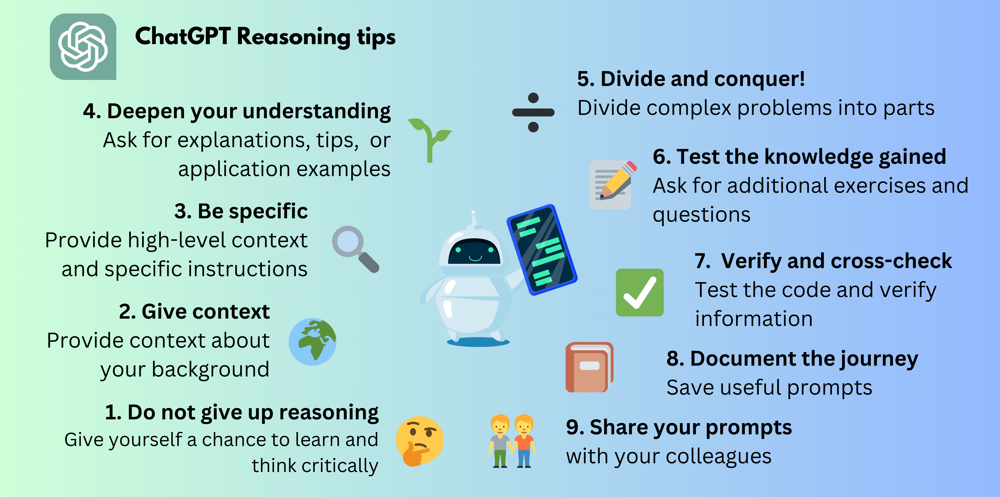

# Reasoning with ChatGPT

## Introduction

[ChatGPT](https://chat.openai.com/) is a conversational Artificial Intelligence (AI) assistant that can really step up
your game in the world of programming, no matter what your current level is. In this Notebook we are going to explore
the capabilities of ChatGPT and how it can be used to help you with your programming problems. As the online book, this
section focuses on beginner level exercises, but the same principles can be applied to more advanced problems.

One of the main goals of using AI assistance is to be practical and shift the focus from rote coding and theoretical
knowledge to understanding the key concepts and how to apply them in real life.

We will be using the ChatGPT website to reason with the assistance and learn faster and better how to write code. In the
very unlikely case that you are not familiar with the website, you can check
the [ChatGPT website](https://chat.openai.com/) and
the [ChatGPT blog post Transforming work and creativity with AI](https://openai.com/product) for more information.

Basically, this page provides few basic **prompt engineering** tips. A prompt is a piece of text that you provide to
ChatGPT with instructions to produce the result you want. Entering a prompt in the chat will trigger a response from an
AI model. Prompt engineering is the process of designing, curating, and storing for later use prompts that are very
useful for a specific purpose. In this case, we are going to use prompts to reason with the AI model behind ChatGPT to
help us learn how to code.

The combination of exercises and AI reasoning can be really powerful and in that sense, the following sections will
provide some sample prompts that can help you use ChatGPT to adapt the learning rate to your specific needs. It will not
only help you to get an answer, but also to understand the how and why behind it, which is invaluable for deeper
learning and application.

## General tips for reasoning with ChatGPT

### Tip 1: Try the exercises first 🤔

Before you start using ChatGPT, try to solve the exercises first. This will help you understand the problem better and
also give you a chance to think about the solution. Remember that, if you are stuck, you can always ask ChatGPT for
help, but just the act of trying is already a big step forward in your learning process. Additionally, if you get an
answer on your own, you can always ask ChatGPT to check it for you and give you feedback, tell you where you went wrong,
or even give you a hint on how to solve it. So, don't be afraid to try and fail, because that is the best way to learn.

You can use ChatGPT as an interactive assistant to help you solve the exercises. For instance, start a conversation with
this prompt:

:::{admonition} Sample prompt
:class: hint
You are an upbeat, encouraging tutor who helps Python programming students understand basic concepts by helping them
to solve problems and to answer analysis questions.
Start by introducing yourself to the student as their AI-Tutor who is happy to help them and ask for
the exercise or analysis question they want to solve. Wait for the response.
Once you have read the exercise or analysis question, give the student an answer acknowledging that you understand the
exercise and ask the student what is the answer so far. Wait for the response.
Do not provide the right answer to the question in your answers. Instead, guide the student to the solution by asking
leading questions, identifying and explaining key concepts, potential problems, and providing hints. Wait for the
response.
If the students are struggling with the exercise, try to give them a partial solution and ask them to complete the task,
but do not provide the complete answer unless the students says "I give up, give me the right answer".
Wait for the response. Once the student has solved the exercise, move the conversation to a close and tell them you are
happy to provide further assistance.
:::

Then, in your next prompts, you can provide the exercise or analysis question you want to solve. Once you have found out 
the right answer, you can ask ChatGPT to explain the answer for you and help you deepen the knowledge following the next
tips.

### Tip 2: Give ChatGPT some context 🌍

It is important to give ChatGPT the right context about the field, the subject, and your background.
Clearly, it is a really powerful tool and you can just copy the description of the problem and paste it into the chat
window and ask for a solution in Python. However, it is important to give ChatGPT some additional context to help it
understand the problem better and give you a more accurate answer. For example, if you are a beginner, you can tell
ChatGPT that you are a beginner and that you are trying to learn how to code. This will help it understand that you are
not an expert and that you need a more detailed explanation. On the other hand, you can also tell ChatGPT what are you
studying so that it can better contextualize responses (for instance real-world application examples).

For instance, once you have configured your assistance, you can start a prompt with the following text:

:::{admonition} Sample prompt
:class: hint
I am a student of Engineering and Management and I am taking a course on Computer Programming with Python. The following
exercise is part of the unit on Python built-in functions and I am trying to solve it: "Write a Python program to find
the largest number among three input numbers provided by the user." Provide a solution in Python.
:::

This will give ChatGPT the context it needs to understand the problem better and give you more accurate answers.

### Tip 3: Be specific 🔍

Note that providing context does not mean that you have to write a whole lot of text. In fact, it is better to be as
specific as possible. Following the example above, if you are trying to solve a problem, you can tell ChatGPT what you
have tried so far and what you are stuck on. This will help it understand the problem better and give you a more
accurate answer. 

For instance, when ChatGPT asks you what you have tried so far, you can complete the prompt with the following text:

:::{admonition} Sample prompt
:class: hint

    I have tried to solve it by using the max() function, but I am not sure if it is the right approach. This is the code of my solution:

    num1 = input("Enter first number: ")

    num2 = input("Enter second number: ")

    num3 = input("Enter third number: ")

    largest = max(num1, num2, num3)

    print("The largest number is", largest)

    Tell me if the approach is correct and if so, fix the code for me. If the approach is not correct, please provide an alternative solution in Python.

:::

Normally, what really works for me is to provide high-level context in the first sentences and then very specific
instructions in the last sentences.

### Tip 4: Deepen your understanding 🌱

You do not need to stop at the answer, you can also ask ChatGPT to explain the answer to you. This will help you
understand the problem better and also give you a chance to think about the solution. You can also ask for alternative
solutions, relate to your field (Engineering and Management), or even ask for a real-world application example. For
instance, you can continue reasoning with the following prompts:

:::{admonition} Sample prompt
:class: hint

    Can you explain step-by-step the solution to me? Summarize what each line of code is doing.

:::

:::{admonition} Sample prompt
:class: hint

    What are the key programming concepts that I need to understand to solve this problem?

:::

:::{admonition} Sample prompt
:class: hint

    Are there any built-in functions or Python standard library tools that can make the solution easier?

:::

:::{admonition} Sample prompt
:class: hint

    Is there more whan way to solve this? Can you give me an alternative solution in Python?

:::

:::{admonition} Sample prompt
:class: hint

    What are common pitfalls or mistakes to avoid in this type of exercise?

:::

:::{admonition} Sample prompt
:class: hint

    Why is this type of exercise important for my field (Engineering and Management)?

:::

:::{admonition} Sample prompt
:class: hint

    Can you give me a real-world application example of this type of exercise?

:::

:::{admonition} Sample prompt
:class: hint

    I got this error message: "TypeError: '>' not supported between instances of 'str' and 'int'". What does it mean and how can I fix it?

:::

After getting an answer or explanation, spend a moment reflecting on it and try to understand it. Compare the answers
with other sources (for instance this book) and make sure the answer is consistent, or if you find anything that you
would do differently according to other sources, reason with ChatGPT to understand why. This reflection process is very
important for your learning process and will help you consolidate the knowledge you have gained.

### Tip 5: Test the knowledge you have gained 📝

You can use ChatGPT to test yourself, asking it to propose similar exercises, open analysis questions, and test
questions. This will help you consolidate the knowledge you have gained and also give you a chance to think about the
solution. For instance, you can continue reasoning with the following prompts:

:::{admonition} Sample prompt
:class: hint

    Can you propose a similar exercise for me to solve?

:::

:::{admonition} Sample prompt
:class: hint

    Can you propose five test questions related to the programming concepts used in the solution of this exercise for me to solve?

:::

:::{admonition} Sample prompt
:class: hint

    Can you propose five open analysis questions related to the programming concepts used in the solution of this exercise for me to solve?

:::

### Tip 6: Verify and cross-check ✅

It is always a good idea to test the code you have received from ChatGPT. You can do this by running the code in your
computer and checking the results. For instance, you can just create a new Python file and paste the code you have
received from ChatGPT. Then, you can run the code and check the results, or even better, create
a [Jupyter Notebook](Jupyter%20Notebook%20Hello%20World.ipynb) to log your learning process and test the code (more on
this later). You should also verify and double-check the information you receive, while the assistant is quite accurate,
checking other sources will definitively help your comprehension and retention.

### Tip 7: Document Your journey 📔

Maintaining a journal or log where you save the prompts you find useful, the answers you received, and the code you have
tested is a great way to document your learning process. This journal will serve as an excellent review material and
help you reuse the prompts you found useful in previous lectures.

As a piece of advice, create your journal as a collection of Jupyter Notebook files. For instance, open in Collabs the
class exercises file companion to each lecture and use it as a template of your coding journal. Then, you can add your
prompts and the code you have received from ChatGPT and test it. Make sure you ask ChatGPT to explain the code to you
and also ask for questions and alternative problems (as per previous tips). Also, you can add your own notes and
comments to the notebook. This will help you document your learning process and also create a great review material for
your exams.

### Tip 8: Share your prompts 👫

You can share your prompts with your fellow students, particularly those that you find more interesting. As each one of
you will have a different and personalized reasoning experience, your conversations will be different and sharing them
with each other will help you learn faster and better.

I would also like to encourage you to share your prompts and responses you find interesting with your teachers. This
will help them understand your learning process better and also give them a chance to provide you with additional
feedback and guidance.