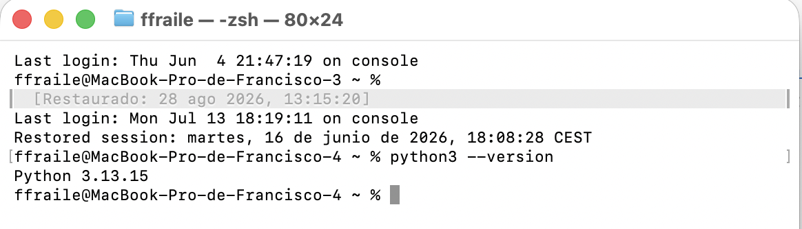
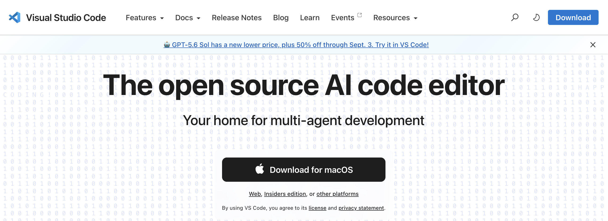
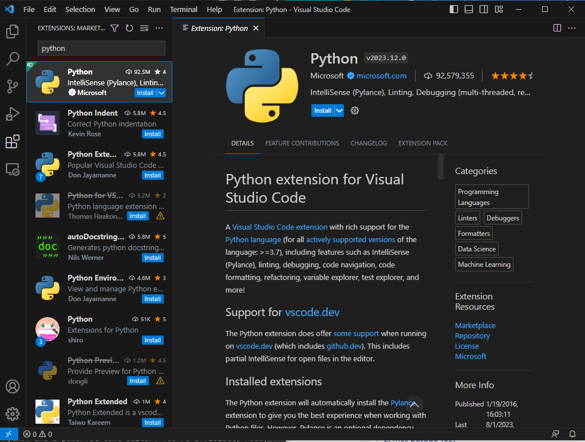
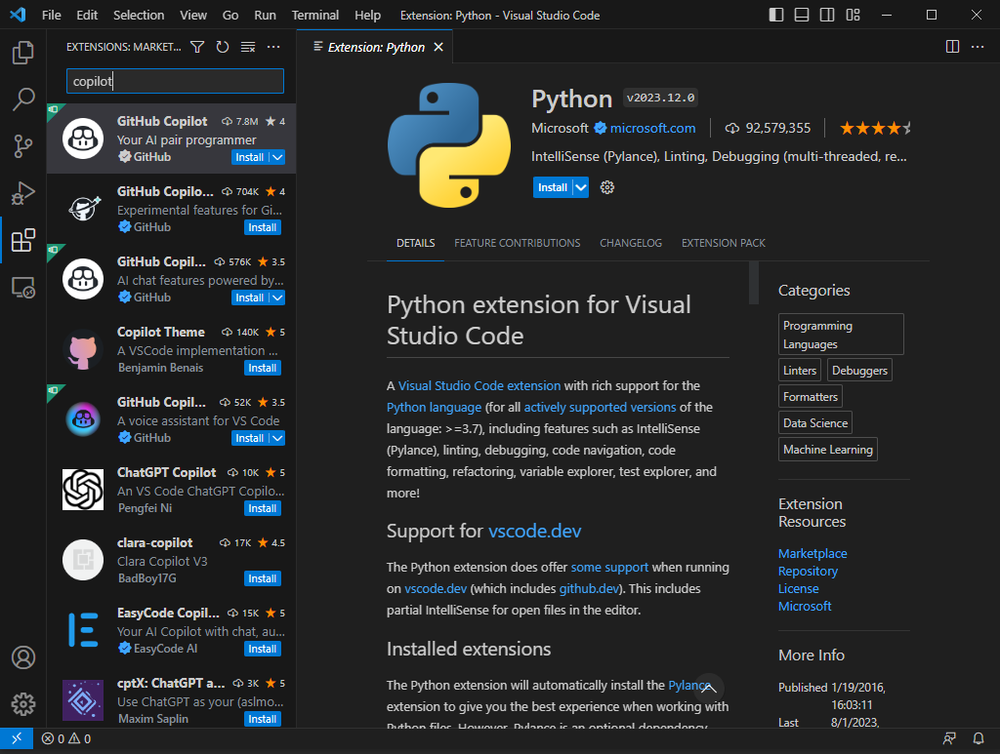

# 🐍 Setting up your Python environment
Are you ready to dive into the world of Python? Let's get started!
This step-by-step guide will walk you through the process of setting up your Python environment.
We will cover the following topics:

1️⃣ [Installing Python](#1-installing-python)

2️⃣ [Installing a Python IDE](#2-installing-a-python-ide)

3️⃣ [Installing Git](#3-installing-git)

4️⃣ [Sign up for GitHub](#4-signing-up-for-a-github-account)

## 1️⃣ Installing Python
First off, we're going to need Python, the language of choice for this course.

### Installing Python on Windows
#### Installing Python using Microsoft Store (Recommended for Windows)
The easiest way to install Python on Windows is through the Microsoft Store. Follow these steps:
1. Open the Microsoft Store app on your Windows computer.
2. Search for "Python" in the search bar.
3. Select the latest version of Python (e.g., Python 3.x) from the search results.
4. Click the "Get" or "Install" button to download and install Python.

Once the installation is complete, you can verify that Python is installed correctly following the instructions in the 
[Verifying Python Installation (Windows)](#verifying-python-installation-(windows))) section below.

#### Installing Python from the official website
To install Python, just go to the official Python downloads page at https://www.python.org/downloads/. The website will 
automatically suggest the best version for your system. Click on the download link and follow the installation instructions.

As a reference, at the time of writing this tutorial, the latest stable version is Python 3.14.7 and below you can 
find links to the installer for Windows:
- [Windows Installer](https://www.python.org/downloads/release/python-3147)


Once the download is complete, just run the installer file and follow the prompts. 
Make sure to check the box that says "Add Python to PATH" before clicking "Install Now". This step is important; it adds
Python to your system's environment variables, making it easier to run.


#### Verifying Python Installation (Windows)
That's it! To check if Python is installed 
correctly, open your system's command line (PowerShell in Windows), type:

```shell
python --version
``` 

To do so, press the Windows key, type "PowerShell", and hit Enter. In the PowerShell window, type the command above and press Enter:


If you followed the steps, you should see Python's version displayed. 🎉

### Installing Python on macOS
#### Installing Python using the official website (Recommended for macOS)
As for Windows, to install Python from the website, just go to the official Python downloads page at https://www.python.org/downloads/. The website will 
automatically suggest the best version for your system. Click on the download link and follow the installation instructions.

As a reference, at the time of writing this tutorial, the latest stable version is Python 3.14.7 and below you can 
find links to the installer for MacOS:
- [MacOS Installer](https://www.python.org/downloads/release/python-3147

Click on the installer link and follow the installation instructions. Once the installation is complete, you can verify that Python is installed correctly following the instructions in the

#### Installing Python using Homebrew (Alternative for macOS)
If you prefer using a package manager, you can install Python using Homebrew. If you don't have Homebrew installed, 
you can install it by following the instructions on the [Homebrew website](https://brew.sh/). 
Once Homebrew is installed, open your terminal and run the following command:

```shell
brew install python
```

#### Verifying Python Installation (macOS)
To check if Python is installed correctly, first open a terminal window. The easiest way to open a terminal window is to 
use Spotlight Search (either click on the magnifying glass icon in the top-right corner of your screen or press Command + Space) and type "Terminal". 
Then, type the following command and press Enter:

```shell
python3 --version
```
You should see Python's version displayed. 🎉




## 2️⃣ Installing a Python IDE
Now that we have Python installed, we need a way to write and run our Python code. For this, we will use an Integrated Development Environment, or IDE in short.

An IDE is a software application that provides comprehensive facilities to computer programmers for software development. 
It typically consists of a source code editor, build automation tools, and a debugger.

For the remaining of the course, we will use [Visual Studio Code](https://code.visualstudio.com/), a free and open-source IDE developed by Microsoft.

Visual Studio Code is a lightweight but powerful source code editor that runs on your desktop and is available for 
Windows, macOS, and Linux. It supports multiple programming languages and additional add-ons and features through 
**extensions**. We will install Visual Studio Code and the recommended extensions for the course. 

### Installing Visual Studio Code

#### Installing from the App Store or Microsoft Store (recommended)
The easiest way to install Visual Studio Code is through the App Store (macOS) or Microsoft Store (Windows):
1. Open the App Store (macOS) or Microsoft Store (Windows) on your computer.
2. Search for "Visual Studio Code" in the search bar.
3. Select Visual Studio Code from the search results.
4. Click the "Get" or "Install" button to download and install Visual Studio Code.

Once the installation is complete, you can launch Visual Studio Code from your applications menu.

#### Installing from the official website

First, Visit the VS Code homepage at https://code.visualstudio.com/.



Then, click on the "Download for Windows" or "Download for Mac" button, depending on your operating system.
Now, just click on the "Download" button for your operating system, then run the installer file and follow the prompts.

At the time of writing, the prompts are: 
- Accept the license agreement (Read it carefully, of course! 😉)
- Choose the destination folder (or leave it as default, which is recommended)
- Choose the start menu folder (or leave it as the default Visual Studio Code)
- Choose the additional tasks (or leave them as default, which is recommended)

###  Installing the Recommended Extensions
We are going to install the following recommended extensions for Visual Studio Code:
- [Python](https://marketplace.visualstudio.com/items?itemName=ms-python.python): This extension provides rich support for the Python language.
- [Cline](https://marketplace.visualstudio.com/items?itemName=saoudrizwan.claude-dev): This extension provides AI-
powered code completion and assistance.
- [Arduino](https://marketplace.visualstudio.com/items?itemName=Arduino.Arduino): This extension provides support for 
Arduino development.

To install the extensions, follow these steps:
1. Open Visual Studio Code.
2. Click on the Extensions icon in the left sidebar (see image below), or press Ctrl+Shift+X on Windows or 
Command+Shift+X on macOS)
3. In the search bar, type the name of the extension you want to install (e.g., "Python").
4. Click on the "Install" button next to the extension in the search results.




As an alternative method, you can also install the extensions directly from the Visual Studio Code Marketplace by 
visiting the links provided above and clicking on the "Install" button.

### Configuring Cline
Once you have installed the Cline extension, you need to configure it to use an AI model. Cline allows you to use some 
AI models for free, but you can also use your own OpenAI, Anthropic, or Google account to access more powerful models. 
To configure Cline, follow these steps:
- Open the extension by clicking on the Cline icon in the left sidebar (see image below).
- If it is the first time you are using Cline, you will be prompted to sign in with your OpenAI, Anthropic, 
or Google account, or you can choose to use the free models provided by Cline. 
  - **Using free models**: The configuration interface will 
forward you to a website where you can complete the required steps. If you are using the free models, you will be 
requested to create a free account with Cline. Once you have completed the sign-in process, you will be redirected back 
to Visual Studio Code.
  - **Using your own account**: The configuration interface will allow you to connect your existing OpenAI, Anthropic, 
  or Google account, and create an API key to use with Cline. Cline will redirect you to the website of the selected 
  provider, where you will be able to create an API key. Once you have created the API key, you will be redirected back to Visual Studio Code.

If you want to change these settings, just click on the gear icon in the Cline extension and select "Settings". 
From there, you can change the AI model.


## 3️⃣ Installing Git
Git is a free and open-source distributed version control system that allows you to track changes in your code and 
collaborate with others. It is widely used in software development and is an essential tool for any developer. 

In this section, we will install Git on your computer and configure it for use with Visual Studio Code.

### Installing Git on Windows
To install Git on Windows, follow these steps:
1. Visit the Git website at https://git-scm.com/install/windows
2. Click on the **Click here to download** button to download the Git installer for Windows.
3. Run the installer and follow the prompts. You can leave the default settings as they are, 
but make sure to select the option to add Git to your system PATH.

### Installing Git on macOS
To install Git on macOS, you can use Homebrew. If you don't have Homebrew installed, you can install it by following 
the instructions on the [Homebrew website](https://brew.sh/). Once Homebrew is installed, open your terminal and run the following command:

```shell
brew install git
```

### Verifying Git Installation
To check if Git is installed correctly, open a terminal window and type the following command:

```shell
git --version
```

You should see Git's version displayed. 🎉

### Using Git with Visual Studio Code
Visual Studio Code has built-in support for Git. To start using Git with Visual Studio Code, you just need to restart 
Visual Studio Code after installing Git. 

## 4️⃣ Signing up for a GitHub account
It is strongly recommended to sign up for a GitHub account, as it will be useful for many things, including:
- Storing your code in the cloud
- Sharing your code with others
- Collaborating with others
- Using GitHub Copilot, an AI-powered pair programmer that helps you write code faster and with less effort.

To sign up for a GitHub account, just go to [github.com](https://github.com) and click on the "Sign up" button, you just need to provide your email address, a username, and a password.


## Extra: Installing Packages with pip
Python comes with a built-in package installation manager called `pip`, which is short for "Pip Installs Packages".
It is used to install and manage software packages written in Python. Using pip is very easy, you just need to open a terminal and type:

```shell
pip install <package_name>
```

For instance, if you want to install the `numpy` package, you just need to type:

```shell
pip install numpy
```

and hit enter. Pip will automatically download and install the package for you.

There are different options to open a terminal, depending on your operating system:
- Windows: Open the Search bad and type "cmd" or "powershell" and hit enter. This will open a terminal window. 
- MacOS: Open the Launchpad and type "terminal" and hit enter. It´s that easy!

You can also open the terminal from VS Code by clicking on the Terminal icon in the Activity Bar (the one that looks like a greater-than sign) or by using the shortcut Ctrl+Shift+`.

### Running Python code from the terminal
You can also run Python code from the terminal. To do so, you just need to type:

```shell
python <path_to_your_python_file>
```

For instance, if you have a file called `hello_world.py` in your Desktop folder, you can run it by typing:

```shell
python C:\Users\<your_username>\Desktop\hello_world.py
```

> ☝ **Important**: If your username has spaces, you need to enclose the path in double quotes, like this:
> ```shell
> python "C:\Users\<your_username>\Desktop\hello_world.py"
> ```

Normally, you would want to run your Python code from the same folder where your Python file is located. To do so, the ```CD``` command is your friend. 
```CD``` stands for "Change Directory", and it allows you to navigate between folders in the terminal. For instance, if you want to navigate to your Desktop folder, you just need to type:

```shell
cd .\Desktop\
```

Note that the backslash is used to separate folders in Windows, while the forward slash is used in MacOS and Linux.

A very handy trick to save time is to use the ```TAB``` key to autocomplete the folder names. For instance, if you type:

```shell
cd D
```

and then hit the ```TAB``` key, the terminal will autocomplete the folder name if there is only one folder that starts with the letter "D". If there are more than one, you can type more letters and hit ```TAB``` again to autocomplete the folder name. You can also use the ```TAB``` key to autocomplete file names, or sub-directories!

## Extra: Signing up for Google AI Plus Student Plan
If you are a student, you can sign up for the Google AI Plus Student Plan, which provides free access to Google Cloud AI 
services, including the use of AI models for your projects. To sign up for the Google AI Plus Student Plan, access
this site: [https://one.google.com/ai-student](https://one.google.com/ai-student) and follow the instructions to sign up.

## Extra: Signing up for GitHub Copilot
Copilot is provided off-the-shelf with your Github account, so you don't need to do anything else to get it, but you will 
need a GitHub Pro account or a free academic account to use it.

> ☝ **Important**: If you are a student, you can get a free GitHub Pro account with unlimited private repositories. Sign 
> up with your student email address at https://education.github.com/pack (students at EDEM preferably use their UPV email address).
> To get the free account, you will need to verify your student status by uploading a photo of your student ID (if it has the expiration date, it's better) or the admission letter.
> The procedure may take a few days, but it's 100% worth it!

Once you have your GitHub account, you can install the GitHub Copilot extension for VS Code by clicking on the Extensions icon in the Activity Bar, as you did for Python:


Then, search for "GitHub Copilot" in the marketplace and install it. It's published by GitHub, you are going to freak out when you see it in action!


