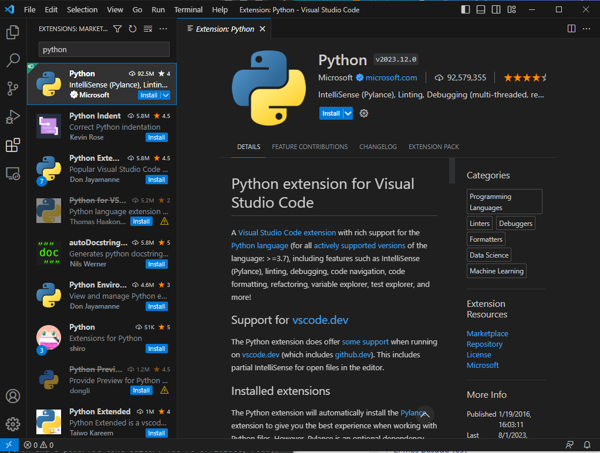

# 🐍 Setting up your Python environment
Are you ready to dive into the world of Python? Let's get started!
This step-by-step guide will walk you through the process of setting up your Python environment.
We will cover the following topics:

1️⃣ [Installing Python](#1-installing-python)

2️⃣ [Installing a Python IDE](#2-installing-a-python-ide)

3️⃣ [Installing Packages with pip](#3-installing-packages-with-pip)

## 1️⃣ Installing Python
First off, we're going to need Python, the language of choice for this and many programmers worldwide, as you may have 
read in the introduction, loved for its simplicity and elegance.

To install Python, just go to the official Python downloads page at https://www.python.org/ and just choose the version 
that is right for your operating system (Windows, MacOS, Linux). 

> ☝ If you hover over the download button in the homepage, Python will automatically detect your operating system and
> show you a link to download the latest stable version. If you are unsure, just click on the button and it 
> will automatically download the installer for your system.


As a reference, at the time of writing this tutorial, the latest stable version is Python 3.11.4 and below you can 
find links to the installers for the most popular operating systems:
- [Windows Installer](https://www.python.org/ftp/python/3.11.4/python-3.11.4-amd64.exe)
- [MacOS Universal Installer](https://www.python.org/ftp/python/3.11.4/python-3.11.4-macos11.pkg)


Now, just run the installer file and follow the prompts. 
Make sure to check the box that says "Add Python to PATH" before clicking "Install Now". This step is important; it adds
Python to your system's environment variables, making it easier to run.

In Windows, you just need to click on the "Add Python to PATH" checkbox, and click on Install Now as shown in the following screenshot:


That's it! To check if Python is installed 
correctly, open your system's command line (PowerShell in Windows and Terminal in MacOS), type:

```shell
python --version
``` 

and hit enter. For instance, the following screenshot 
shows how to do it in Windows PowerShell (wow, it has not been updated in a while!):


If you followed the steps, you should see Python's version displayed. 🎉

## 2️⃣ Installing a Python IDE
Now that we have Python installed, we need a way to write and run our Python code. For this, we will use an Integrated Development Environment, or IDE in short.
If you want to know what IDEs can do for you, and why you should use one, and what other popular tools are there, 

I strongly suggest you to check out this [tutorial](../../Software%20Engineering/tutorials/Development%20Tools.ipynb).

For the remaining of the course, we will use [Visual Studio Code](https://code.visualstudio.com/), a free and open-source IDE developed by Microsoft.

First, Visit the VS Code homepage at https://code.visualstudio.com/.


Then, click on the "Download for Windows" or "Download for Mac" button, depending on your operating system.
Now, just click on the "Download" button for your operating system, then run the installer file and follow the prompts.

At the time of writing, the prompts are: 
- Accept the license agreement (Read it carefully, of course! 😉)
- Choose the destination folder (or leave it as default, which is recommended)
- Choose the start menu folder (or leave it as the default Visual Studio Code)
- Choose the additional tasks (or leave them as default, which is recommended)

##  Installing the Python extension
Once installed, open VS Code and navigate to the Extensions view by clicking on the Extensions icon in the Activity Bar, which is the vertical menu bar on the left side of the window. 
(or use the shortcut Ctrl+Shift+X). The Extensions icon is the one that looks like a square with four squares in it and at the time of writing is the fifth icon from the top.
Search for the Python extension in the marketplace and install it. It's published by Microsoft, and it's going to make your Python coding in VS Code a breeze!



You're all set! You've got Python and a powerful text editor. You're officially ready to start your Python journey! 
But don't worry; we're just getting started. In our upcoming lectures, 
we'll explore the magic of Python together, and trust me, you're going to love it! 🚀

So, welcome aboard, future Pythonista! You've just taken your first step into a bigger world.

## 3️⃣ Installing Packages with pip
Python comes with a built-in package installation manager called `pip`, which is short for "Pip Installs Packages".
It is used to install and manage software packages written in Python. Using pip is very easy, you just need to open a terminal and type:

```shell
pip install <package_name>
```

For instance, if you want to install the `numpy` package, you just need to type:

```shell
pip install numpy
```

and hit enter. Pip will automatically download and install the package for you.

There are different options to open a terminal, depending on your operating system:
- Windows: Open the Search bad and type "cmd" or "powershell" and hit enter. This will open a terminal window. 
- MacOS: Open the Launchpad and type "terminal" and hit enter. It´s that easy!

You can also open the terminal from VS Code by clicking on the Terminal icon in the Activity Bar (the one that looks like a greater-than sign) or by using the shortcut Ctrl+Shift+`.

### Running Python code from the terminal
You can also run Python code from the terminal. To do so, you just need to type:

```shell
python <path_to_your_python_file>
```

For instance, if you have a file called `hello_world.py` in your Desktop folder, you can run it by typing:

```shell
python C:\Users\<your_username>\Desktop\hello_world.py
```

> ☝ **Important**: If your username has spaces, you need to enclose the path in double quotes, like this:
> ```shell
> python "C:\Users\<your_username>\Desktop\hello_world.py"
> ```

Normally, you would want to run your Python code from the same folder where your Python file is located. To do so, the ```CD``` command is your friend. 
```CD``` stands for "Change Directory", and it allows you to navigate between folders in the terminal. For instance, if you want to navigate to your Desktop folder, you just need to type:

```shell
cd .\Desktop\
```

Note that the backslash is used to separate folders in Windows, while the forward slash is used in MacOS and Linux.

A very handy trick to save time is to use the ```TAB``` key to autocomplete the folder names. For instance, if you type:

```shell
cd D
```

and then hit the ```TAB``` key, the terminal will autocomplete the folder name if there is only one folder that starts with the letter "D". If there are more than one, you can type more letters and hit ```TAB``` again to autocomplete the folder name. You can also use the ```TAB``` key to autocomplete file names, or sub-directories!

## Extra: Signing up for GitHub and Copilot
It is strongly recommended to sign up for a GitHub account, as it will be useful for many things, including:
- Storing your code in the cloud
- Sharing your code with others
- Collaborating with others
- Using GitHub Copilot, an AI-powered pair programmer that helps you write code faster and with less effort.

To sign up for a GitHub account, just go to github.com and click on the "Sign up" button, you just need to provide your email address, a username, and a password.

Copilot is provided off-the-shelf with your Github account, so you don't need to do anything else to get it, but you will 
need a GitHub Pro account or a free academic account to use it.

> ☝ **Important**: If you are a student, you can get a free GitHub Pro account with unlimited private repositories. Sign 
> up with your student email address at https://education.github.com/pack (students at EDEM preferably use their UPV email address).
> To get the free account, you will need to verify your student status by uploading a photo of your student ID (if it has the expiration date, it's better) or the admission letter.
> The procedure may take a few days, but it's 100% worth it!

Once you have your GitHub account, you can install the GitHub Copilot extension for VS Code by clicking on the Extensions icon in the Activity Bar, as you did for Python:


Then, search for "GitHub Copilot" in the marketplace and install it. It's published by GitHub, you are going to freak out when you see it in action!


